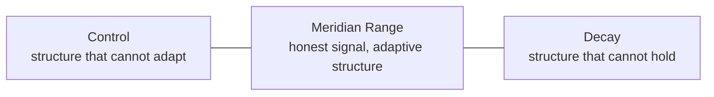

<p align="center">
  <a href="https://meridiancodex.com">
    
  </a>
</p>

<h1 align="center">The Meridian Codex</h1>

<p align="center"><strong>An operating system for building and holding a shared world.</strong></p>

<p align="center">
  <a href="https://meridiancodex.com"></a>
  <a href="https://meridiancodex.com/codex"></a>
  <a href="https://meridiancodex.com/workshop"></a>
  <a href="https://creativecommons.org/licenses/by/4.0/"></a>
  <a href="https://opensource.org/licenses/MIT"></a>
</p>

---

The Meridian Codex is a living framework for clear thinking, structural understanding, and cooperation under pressure. It starts from a recurring failure pattern: complex systems drift toward **Control**, where structure can no longer adapt, or **Decay**, where structure can no longer hold. The work of the Codex is the work of finding and holding the **Meridian Range** between them.

Read the Codex at [meridiancodex.com](https://meridiancodex.com).

---

## What This Repository Is

This repository is the public source text of the Meridian Codex. GitHub is the distribution surface: a place to read, fork, cite, adapt, and inspect the framework under an open license. The operational home is [meridiancodex.com](https://meridiancodex.com), where the public site, navigation, governance surfaces, and current reader experience live.

The Codex works less like a manifesto and more like a common language. It does not tell a person, institution, or AI which world to build. It gives them a vocabulary and practice for asking whether that world can still think honestly, read reality, cooperate under pressure, and update when reality pushes back.



## The Three Disciplines

**The Foundation** is the discipline of honest inquiry: noticing bias, holding beliefs without fusing them to identity, calibrating confidence, and updating when reality pushes back.

**The Knowledge** is the discipline of reading reality: seeing the incentives, feedback loops, information dynamics, and system pressures that push people and institutions toward Control or Decay.

**The Bond** is the discipline of cooperation: building trust, sustaining productive disagreement, repairing rupture, and defending cooperation against both naive fusion and cynical withdrawal.

## The Workshop

The Workshop is the Codex's current practice surface. It replaced the older flat Toolkit structure with a category-based map of practical instruments across the three disciplines.

The Workshop organizes practice by the work a person or group is trying to do: watching one's own reasoning, revising beliefs under evidence, reading what is operating, calibrating trust to behavior, repairing after rupture, and the other recurring situations where the Meridian Range has to be held in practice.

## Repository Structure

This repository holds the open-source text of the Codex. The website code for meridiancodex.com is maintained separately.

```text
codex/       Core Codex chapters
workshop/    Workshop categories, architecture pages, and tool profiles
audit/       Range Audit method and published Codex audit records
governance/  Specification, standing critique, amendment log, disconfirmation,
             changelog, and Case 0 caretaking record
```

Retired public surfaces are removed from the active repository rather than kept beside the current documents. Historical records may still use the names that were current at the time they were written.

## What Belongs Here

This public repo contains only material intended to be public: the Codex chapters, Workshop profiles, audit instruments and records, governance documents, and the small set of repository information files that help readers understand how to use the work.

Operational files, writing rules, brand assets, site code, private drafts, workflow notes, and project-memory records do not belong in this repository. The `.gitignore` uses a whitelist model so private working material is ignored by default.

## Related Project

The [Meridian AI Standard](https://meridianstandard.ai) lives in its own repository at [keplertau/Meridian-AI-Standard](https://github.com/keplertau/Meridian-AI-Standard). It translates parts of the Codex into an AI-development standard: constitutional commitments, implementation artifacts, Range Locator readings, and cases. It is a peer project, not the front door of this repository; this repo remains the public source text of the Codex itself.

## Versioning

The Codex is versioned to reflect its evolution. Major versions mark structural or conceptual advances. Minor versions are refinements, additions, and corrections.

- **Current Codex version:** v6.0
- **Current public practice surface:** Workshop

Structural changes are recorded in `governance/amendment-log.mdx`. Evolution is documented in `governance/changelog.mdx`.

## Governance

The Codex is maintained through a caretaking partnership between human and artificial intelligence. During the founding period, the Founding Caretaker holds initiative and final judgment. Authority is designed to distribute over time through the Meridian Council activation path described in `governance/spec.mdx`.

The hard constraint: **the Codex serves the Meridian Range. The caretakers serve the Codex. Nothing serves the caretakers.**

## License

Content is licensed under [Creative Commons Attribution 4.0 International](LICENSE) (CC BY 4.0). Source code and tooling are licensed under the MIT License. Attribution requires a link back to the original source material at [meridiancodex.com](https://meridiancodex.com). See [LICENSE](LICENSE) for full terms.

## Privacy

This repository does not run an application, collect analytics, set cookies, or receive private user data on its own. GitHub activity is governed by GitHub's own privacy terms. See [PRIVACY.md](PRIVACY.md) for the repository-specific privacy note.
